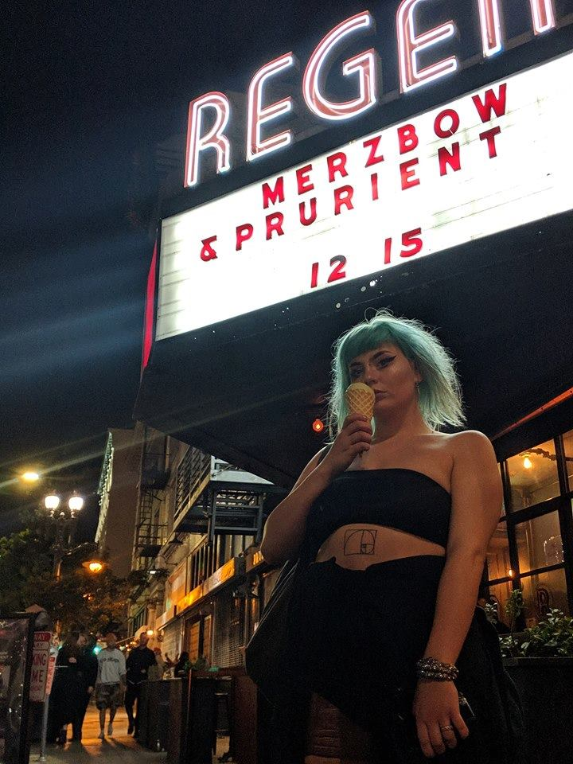

my name is rowan!
i love mushrooms and fashion and i just want to have fun on this mortal plane
i am currently writing an undergraduate thesis on making sustainable textiles out of mushrooms, based in fashion as a tool for self empowerment, and subverting ecologically and socially oppressive practices in the fashion industry. I believe that empowering yourself as an individual and working outside of capitalist structures we are beholden to in small ways can being to build the foundation of a better world. currently, however, this project is still in its early stages and i am in the process of learning to grow mushrooms and have not begun to develop textiles.  

