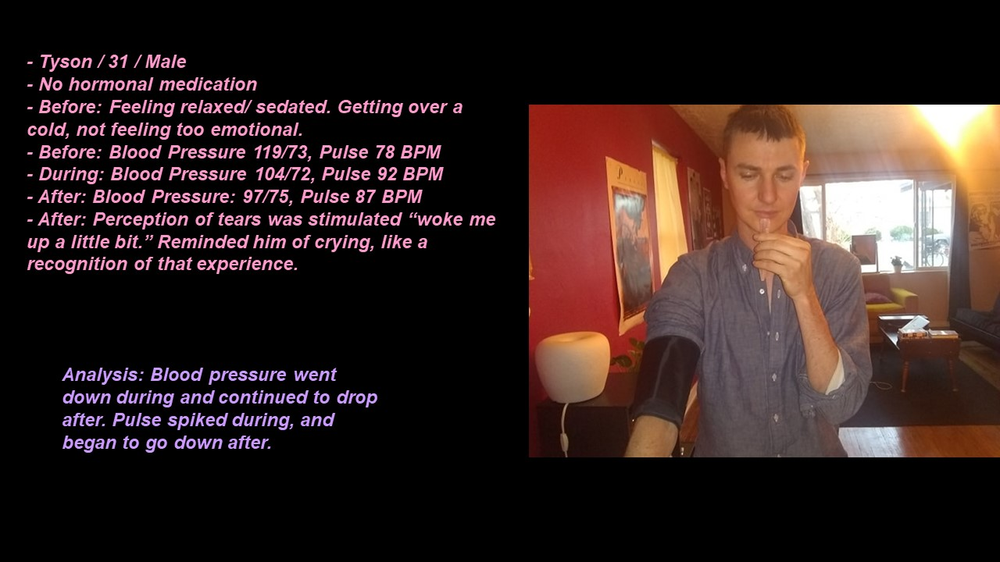
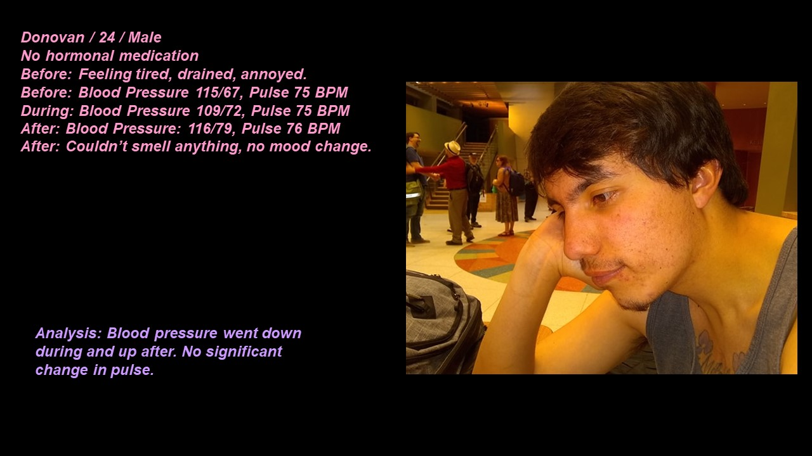
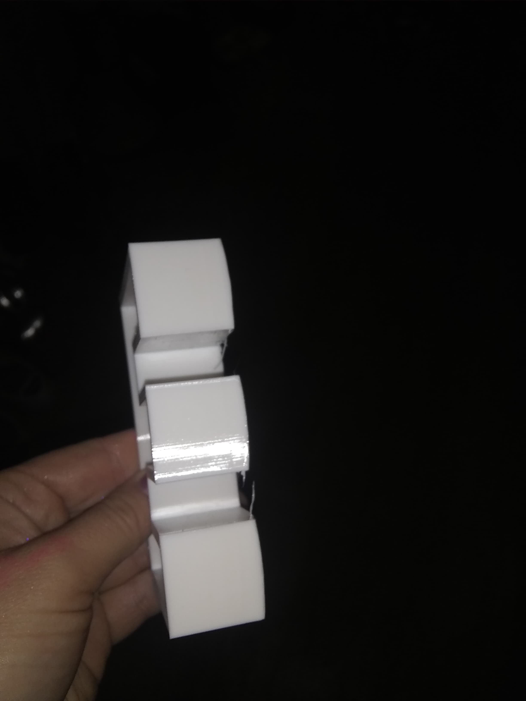
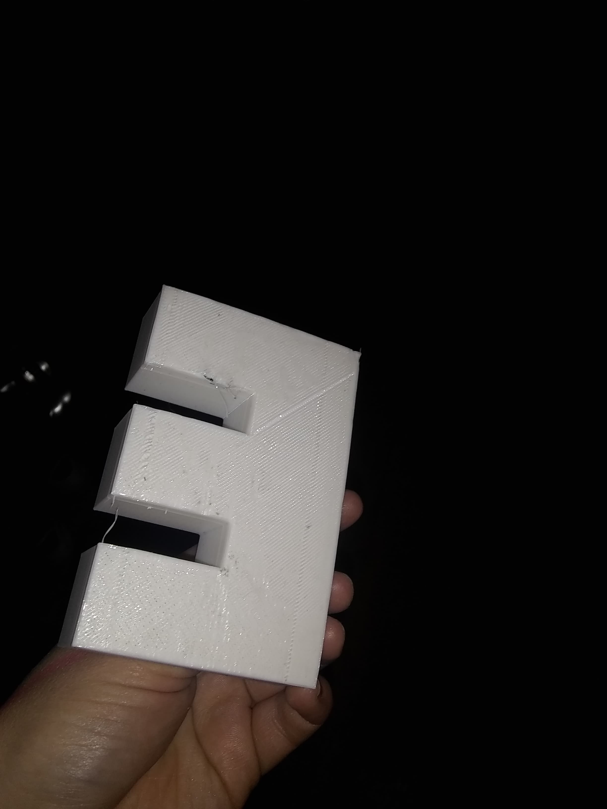

Biohack Final

Here is a link to my presentation video : https://vimeo.com/328076333

Here are my slides as photos. They include 8/10 of the people surveyed

               

Note Documentation

I recently came across a large roll of butcher paper, so I'm trying to do large notetaking in my studio and see how that affects my practice.

  

Midterm Presentation

      

Lab visit

For my lab visit project, I went to the mycology lab on campus. It was an interesting experience, and the mycologist (one of the 2 at unm) seemed more interested in genetics and the model organism neospora crassa rather than mycology in general. Regardless, we had a good talk about fungi in regards to art and what citizen science means.

       

Project 1: Petri dish in the shape of an "e"
I wanted to 3d print a petri dish in the shape on an E for a project in my "Experiments in Cinema" class, but after it took a long time and I realized I was limited on time, it didn't seem practical to 3d print petri dishes to spell out the entire word "experiments" 

Anyways, it still turned out cool!

my name is rowan!

i love mushrooms and fashion and i just want to have fun on this mortal plane

i am currently writing an undergraduate thesis on making sustainable textiles out of mushrooms, based in fashion as a tool for self empowerment, and subverting ecologically and socially oppressive practices in the fashion industry. I believe that empowering yourself as an individual and working outside of capitalist structures we are beholden to in small ways can being to build the foundation of a better world. currently, however, this project is still in its early stages and i am in the process of learning to grow mushrooms and have not begun to develop textiles.  

